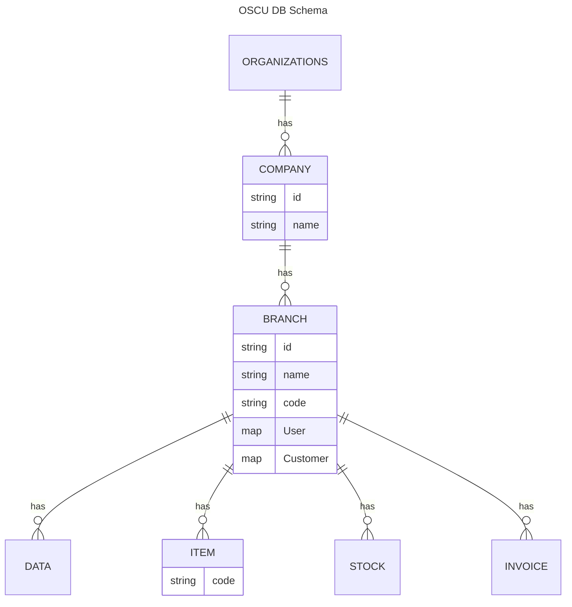

# OSCU Configuration

## API spec

```js
{"method": "GET", "name":  "Service Health Check", "endpoint":"/health-check"}
```

## DB Schema (Firesotre)


```mermaid
---
title: OSCU DB Schema
---

erDiagram

COMPANY{
    string id
    string name
}

BRANCH{
    string id
    string name
    string code
    map User
    map Customer
}

ITEM{
    string code
}


ORGANIZATIONS ||--o{ COMPANY : "has"
COMPANY ||--o{ BRANCH : "has"
BRANCH ||--o{ DATA : "has"
BRANCH ||--o{ ITEM : "has"
BRANCH ||--o{ STOCK : "has"
BRANCH ||--o{ INVOICE : "has"

```
